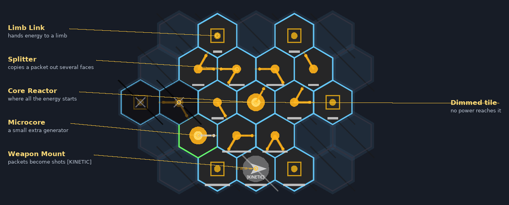
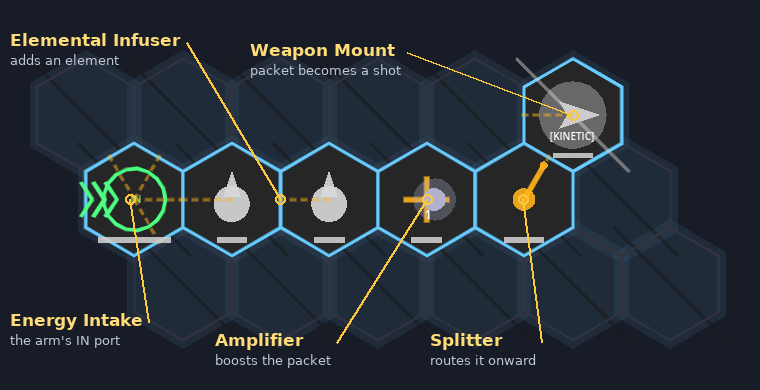
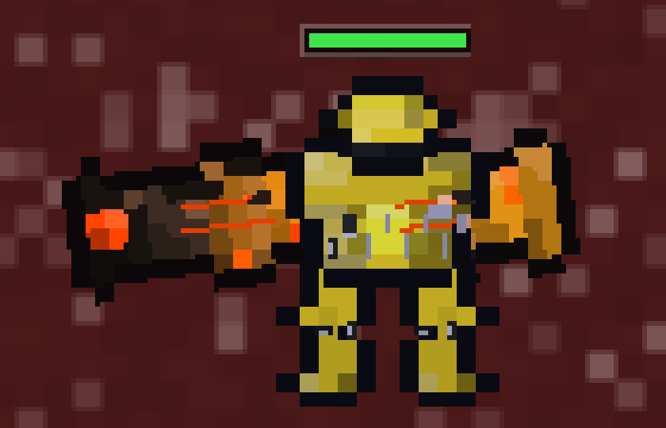

# PIXBOTS-G: THE COMPREHENSIVE TECHNICAL MANUAL

Welcome to Pixbots-G, an engineering-focused Mech combat sandbox. This comprehensive manual details everything from the procedural energy-routing engine to the evolving AI that learns to defeat you.

## 1. INSTALLATION & SETUP

### Prerequisites
- **Godot Engine**: Download and install Godot Engine **v4.6 or higher** (Standard version, .NET not required) from the [official website](https://godotengine.org/download).
- **Git**: Ensure Git is installed on your system if you plan to clone the repository.

### Installation Steps
1. **Clone the Repository**:
   ```bash
   git clone https://github.com/Utility-SOC/Pixbots-G.git
   ```
2. **Build the Rust extension** (once per fresh clone; needs the [Rust toolchain](https://rustup.rs)). The built libraries are gitignored, so the extension won't load until you do this. The game falls back to slower pure-GDScript paths where it can, but a build is recommended:
   ```bash
   cd Pixbots-G/rust_ext
   cargo build --release   # and `cargo build` if you'll run from the editor's debug config
   ```
   See `rust_ext/README.md` for troubleshooting.
3. **Open the Project in Godot**: Launch Godot, click **Import**, select `project.godot` in the repository root (`Pixbots-G/project.godot`), and click **Import & Edit**.
4. **Run the Game**: Click the **Play** button (or press `F5`). 

---

## 2. THE HEX GRID IN 60 SECONDS

Every body part of your mech (torso, arms, legs, head, backpack) contains its own **hex grid**. You fill it with **tiles**; the game then simulates energy flowing through it, and whatever reaches a Weapon Mount (or a Shield, Actuator, Jumpjet...) is what your mech can actually do. The whole game is arranging that grid well.



*The torso grid. The **Core Reactor** emits energy; **Splitters** copy it onward; **Limb Links** pass it into arms, legs, head and backpack; a **Weapon Mount** turns it into shots. Blue outlines are powered tiles, the dimmed ones receive nothing.*

Energy travels as **packets** that hop from tile to tile, one step at a time. Each tile can change a packet before passing it on:



*An arm grid: energy enters at the **IN** port, picks up an element in the **Infusers**, is boosted by the **Amplifier**, routed by a **Splitter** and finally fired from the **Weapon Mount**. Press **Simulate Energy Flow** in the Garage to watch the packets move (the number on a packet is its magnitude).*

A few things worth knowing before you dive in (everything else is for you to discover):
- **Colour and shape mean something.** Amber icons are routing/modifier tiles, the outline colour shows power state, and each element has its own colour (see the synergy list below).
- **Your mech looks like its grid.** Weapon barrels lengthen arms, Jumpjets/Actuators add vents, Shield/Anchor tiles add armour plates, Microcores and Accumulators add cells, and the overall tint drifts toward your dominant element. Enemies and bosses are drawn the same way, so you can read a build before it hits you.



*A close-range fire build in battle: the big barrel on the left arm and the orange glow come straight from the tiles inside it.*

**Garage safety nets:** unpowered tiles dim, tiles show energy bars, and if energy loops back on itself (an Infuser/Amplifier inside a ring can keep re-adding to the same packets until the whole part saturates) the looping tiles are outlined red with a warning. Press **F5** or **Ctrl+Enter** to deploy straight from the Garage.

---

## 3. THE GARAGE & UPGRADE ECONOMY

The Garage is your engineering bay. Here, you construct the energy grids that power your Mech. 

### The Garage Interface (Buttons & Toggles)
When you enter the Garage, you will interact with several controls:
- **Component Tabs**: Select which part of your Mech to edit (Torso, Left Arm, Right Arm, Left Leg, Right Leg, Head).
- **Swap Component**: Opens your inventory to replace the currently selected component with another one (e.g., swapping a damaged limb for a new one).
- **Infuse (Destroy part)**: Destroys a component from your inventory to grant XP to the currently equipped component, leveling it up and unlocking stat modifiers.
- **Simulate Energy Flow**: A crucial debugging tool. Clicking this button visualizes the BFS (Breadth-First Search) routing of energy packets through your grid, showing exactly what output your Weapon Mounts will receive.
- **Auto-Equip**: The solver automatically fills empty grid spaces with a mathematically optimal setup. It can even route energy feeds from your Torso across components, snaking pipes into your Arms, Legs, and Head seamlessly!
- **Clear Grid**: Wipes all tiles off the currently selected component.
- **Separate L/R Firing**: A toggle that dictates whether Left-click fires all weapons, or if Left-click fires Left Arm/Torso weapons and Right-click fires Right Arm weapons.
- **Show Static Paths**: Toggles the permanent visualization of energy pipes.

### The Black Market
The Black Market is a shop that offers specialized, high-tier components and tiles.
- **Rotation**: The shop rotates its inventory deterministically every 10 minutes of real time.
- **Purchasing**: You buy items using Scrap gathered from combat.
- **Equipping**: Once purchased, new tiles go to your inventory for grid placement, and new components can be swapped onto your chassis via the **Swap Component** button in the Garage. Beware: Black Market components often come with "forbidden-tile" drawbacks or unique cursed geometries!

---

## 4. HEX TILES, RARITIES, AND SYNC DEVIATIONS

Your Mech is built from Hex Tiles. Every tile belongs to a rarity tier that dictates its efficiency, volatility, and features.

### Rarity System & Sync Deviations
Higher rarity tiles offer massive multipliers, but they introduce **Sync Deviations**. 
In Pixbots-G, if two energy paths merge at a Weapon Mount, they only combine their power if they arrive on the EXACT same **Traversal Step** (the "latency" or "phase" of the packet). 
- **COMMON & UNCOMMON**: Standard specification. Reliable, with no sync adjustment (deviation of 0).
- **RARE**: 40% probability of exhibiting a minor sync deviation (+1 or -1 traversal step).
- **LEGENDARY**: Highly volatile prototypes. 80% probability of exhibiting a significant sync deviation (+1, -1, +2, or -2).
- **MYTHIC**: Game-breaking tiles with unique, rule-bending toggles (see tile descriptions below).

*Warning: If you split a packet into two parallel paths using Legendary tiles, their Sync Deviations might desync the packets, causing them to arrive at the weapon mount at different times, firing two weak shots instead of merging into one massive shot!*

### Exhaustive Tile Glossary & Rarity Scaling

**Power Generation & Storage**
- **Core Tile**: The primary power source. Generates RAW energy packets. 
  - *Mythic Toggle*: Native Element (Core outputs a specific element instead of RAW).
- **Microcore Tile**: A secondary, localized generator with fewer output faces. 
  - *Common/Uncommon*: 2 faces (50-75 output).
  - *Rare*: 3 faces (120 output). 
  - *Legendary*: 4 faces (200 output). 
  - *Mythic*: 6 faces (320 output).
- **Accumulator Tile**: Stores excess energy. Discharges when primary draw exceeds generation. *Combat Mechanics*: Accumulators passively charge. You can left-click for standard fire (with a quality tax) or hold 1/2/3 to pre-prime and dump the full stored value in a massive volley.

**Routing & Modulation**
- **Splitter Tile**: Receives a packet and duplicates it. 
  - *Common/Uncommon*: Splits into 2 faces.
  - *Rare*: Splits into 3 faces.
  - *Legendary*: Splits into 5 faces.
  - *Mythic*: Splits into all 6 faces + x2 output multiplier!
- **Directional Conduit Tile**: Forces energy to flow in one specific direction (prevents backflow).
- **Amplifier Tile**: Modulates the packet, increasing its magnitude. *Overlimit Note*: Amplification has a hard mathematical ceiling of **150,000 magnitude**. If a packet exceeds this ceiling, it is clamped. 
  - *Uncommon*: 1.2x. *Rare*: 1.5x. *Legendary*: 3.0x. *Mythic*: 5.0x + Focus Toggle (Condense amplification to a single extreme output).
- **Filter Tile**: Only allows specific elemental energy to pass through.
- **Catalyst Tile**: Converts standard energy into elemental energy. 
  - *Mythic Toggle*: `cycle_synergy()` (Invert or rotate the output element).
- **Reflector Tile**: Bounces energy packets back by altering their angle. *The Reflector does not simply reverse the packet; it reflects it at the specific angular rotation steps you have set for it!*
- **Resonator Tile**: Leaves a "remnant" (15%) of the synergies that pass through it. The *next* packet that passes through absorbs 80% of those remnants. This confers qualities from one synergy to another (e.g. turning Kinetic packets slightly Fire-based)!
  - *Uncommon*: 1.2x boost. *Rare*: 1.5x. *Legendary*: 3.0x. *Mythic*: 5.0x.
- **Infuser Tile**: Consumes two different elemental packets to output a combined, higher-tier elemental packet.
- **Magnet Tile**: Alters the flow of packets based on rules. 
  - *Uncommon*: 1.2x pull. *Rare*: 1.5x. *Legendary*: 2.0x. *Mythic*: 3.0x + Attract/Repel mode + Rarity Filter!

**Utilities & Combat**
- **Weapon Mount Tile**: Converts incoming packets into offensive projectiles based on the energy's element. 
  - *Mythic Feature*: Cycle through firing configurations: **Normal** (Standard shot), **Shotgun** (5 pellets, 40% dmg each), **Radial Burst** (360-degree burst of 8 shots, 50% dmg each), **Beam** (Concentrated, ultra-fast piercing laser).
- **Shield Generator Tile**: Converts packets into a defensive barrier that fully absorbs incoming damage while it holds.
  - *Uncommon*: 1.5x efficiency. *Rare*: 2.5x. *Legendary*: 5.0x. *Mythic*: 10.0x.
- **Actuator Tile**: Consumes energy to increase base movement speed.
- **Jumpjet Tile**: Grants aerial evasion/traversal. *Mechanic*: If you traverse water hazards, jumpjets automatically activate and sustain to prevent drowning!
  - *Uncommon*: 1.2x efficiency. *Rare*: 1.5x. *Legendary*: 2.0x. *Mythic*: 3.0x + Blink Toggle (Instant teleportation).

---

## 5. ELEMENTAL SYNERGIES & ROCK-PAPER-SCISSORS

When specialized energy packets reach a Weapon Mount, they trigger unique subroutines. Projectiles blend physical properties (speed, scale, lifetime, trails, and color) proportionally based on the synergy ratios in the packet.

- **RAW**: Baseline energy. Reliable but no special effects.
- **KINETIC**: Massively extends weapon range and maintains a locked, unwavering straight trajectory.
- **FIRE**: Ignites the impact zone. Experiences high air resistance.
- **ICE**: Heavy, crystalline mass that resists steering and slows target movement/processing speeds (Freezing).
- **POISON**: Corrosive acid that arches in a gravity-affected lob.
- **LIGHTNING**: Fires an instant stylized polyline that arcs to secondary targets within a localized radius, paralyzing them.
- **VAMPIRIC**: Actively curves its trajectory to seek and hunt down enemy units ("The Hunter"). Heals the shooter based on damage dealt.
- **VORTEX**: Generates a localized gravity well, pulling nearby units out of formation.
- **PIERCE**: High-velocity, armor-piercing rounds with a percentage chance to instantly execute ("cut in half") non-boss targets.
- **EXPLOSION**: Standard AoE blast damage on impact.

### Elemental Rock-Paper-Scissors (Shield Counters)
Different elements deal double damage (2.0x) against specific elemental shields:
- **FIRE** melts **ICE** Shields.
- **ICE** extinguishes **FIRE** Shields.
- **POISON** corrupts **VAMPIRIC** Shields.
- **VAMPIRIC** drains **POISON** Shields.
- **KINETIC** shatters **LIGHTNING** Shields.
- **LIGHTNING** surges through **KINETIC** Shields.
- **VORTEX** crushes **KINETIC** Shields.
- *Note*: **LIGHTNING** is inherently volatile and deals a flat 1.5x bonus damage against ALL shields!

---

## 6. THE AI SYSTEM & SQUAD DIRECTOR

Pixbots-G doesn't use random spawns; you are fighting a learning AI called the **Squad Director**. 

### Enemy Chassis & Roles
The AI fields specialized bots tailored to counter you:
- **SCOUT**: Low HP, extreme mobility. Engages at max range. Often equipped with Jumpjets or Jammers.
- **BRAWLER**: High HP, moderate mobility. Engages at close range.
- **SNIPER**: Fragile, maintains maximum distance. Low fire rate, extreme accuracy.
- **AMBUSHER**: Uses Cloaking to sneak up and unleash high fire-rate bursts. 
- **FLAMETHROWER**: Heavy chassis built to close in and deploy AoE elemental damage.
- **SUPPORT**: Carries Heal Beacons and defensive auras to protect the squad.
- **JAMMER**: Specialized electronic-warfare mechs that disable your elemental synergies.
- **COMMANDER**: A high-tier leader unit that can carry up to 5 support modules to buff an entire squad!
- **BOSS**: A massive, 5x-scaled mech with extreme health pools and unique drop tables. Boss kits (abilities, enrage styles, and positioning) now mutate and evolve based on combat fitness!
- **DIVER**: An amphibious scout-analogue that flanks quickly through water hazards.
- **DRONES**: Small automated units deployed from Drone Bays.

### The Squad Director & Persistent Learning
The AI merges wild bots into squads and actively mutates its templates based on fitness (combat success).
- **Persistent Evolution**: The AI Director **saves its learned strategies** and your **combat telemetry** to disk between sessions! If it learns that Snipers beat you today, it will spawn Snipers tomorrow. 
- **Reactive Resistance Profiling**: The Director tracks your elemental damage output across runs. If you over-rely on FIRE, it will continuously deploy Fire-resistant mechs and FIRE-Jammer modules.
- **Execute Counterplay**: If you over-rely on Piercing instant-kills, the Director logs your "kill methods" and will dynamically deploy **Piercing Jammers**. Units inside a Piercing Jammer's aura (along with Bosses and Commanders) are immune to executes!
- **Frontier Searching**: AI squads now share search memory, actively mapping out unexplored map cells rather than redundantly sweeping the same ground.

### Squad Tactics (new)
Squads no longer just charge. A `SquadTactics` layer gives each member a part in a wave-gated plan: **swarm**, **synchronized strike**, **pincer**, **hammer & anvil**, **encircle** and **bait & flank**. Parts (FLANK, PIN, COVER, BAIT, RING, STAGE) show in the enemy's state tag, enemies solve a true intercept when leading shots, and a plan that isn't landing hits triggers a replan. Plans themselves are a **tactic genome**: a pool of archetype + parameter genomes that is bred, culled and saved alongside the squad templates.
- **Movement-habit model**: the AI watches how *you* move (camper / kiter / brawler / strafer, and which way you retreat) and weights plans accordingly. Pincer-style squads send a flanker to cut off your usual retreat heading.
- **Orders log**: a slow, rate-limited feed in the HUD where squads announce what they are doing ("pincer committing", "replanning", "squad wiped"), so you can read the AI instead of guessing.
- **Design rule**: the game gets harder through *behaviour and loadout*, not by inflating stats or racing to Mythic tiers. Rarer components unlock by wave.
- Full design notes: [`docs/ENEMY_AI_DESIGN.md`](docs/ENEMY_AI_DESIGN.md).

### Sharing AI: gene pool & style cards (new)
Share your trained AI as clipboard JSON or as a **Style Card** (your champion's PNG card carrying a hidden gene payload). Only genes travel, never your telemetry or movement profile. Imports arrive on **probation**: capped, reduced-weight and cross-bred with your local best, so a friend's "fast closers" and your "snipers" breed together rather than overwriting each other. Donor builds are spliced in one body slot at a time and must out-fight the current champion to stay. The War Room shows an "AI variety" line and an import preview.

### Bosses (updated)
Bosses now have **11 telegraphed abilities** (new: meteor rain, minefield, gravity well, triple rail, charge), **6 enrage styles** (new: relentless, phase shift) and **5 position styles** (new: teleporter, lurker), all of which evolve. Bosses never summon adds, and every ability is telegraphed on the ground.

### The War Room Interface
Press **`TAB`** in-game to access the War Room. 
- **Lineage Graphs & Fitness Logs**: View a visual log of the AI's evolving lineage, the current fitness scores of its Squad Templates, and what compositions it is favoring.
- **Export to Clipboard**: Copies the AI's current learned profile (as JSON text) so you can share it with friends!
- **Import from Clipboard**: Overwrites the AI's current state with a profile you pasted, allowing you to fight the exact AI your friend trained.


---

## 7. ENGINEERING BEST PRACTICES & SANDBOX FUN

The engine is robust, but you can try to break it!


### Routing Suggestions
- **The Closed Loop**: Route energy through a Resonator, into a Reflector, and back through the Resonator to stack efficiency multipliers before splitting the packet off to your weapons.
- **Elemental Dual-Wielding**: Split your Core's output and route them through two different Elemental Infusers. This bypasses the Squad Director's Resistance Profiling by keeping your elemental damage ratios perfectly balanced!
- **Burst Buffer**: Place an Accumulator right before an Amplifier and Weapon Mount. Store energy during downtime, then release a massive pre-primed volley (by holding 1/2/3) to unleash an opening burst attack.
- **The Speed Demon**: Try filling your Legs and Torso exclusively with Jumpjet and Actuator Tiles, feed them pure KINETIC energy, and phase through the environment.
- **The Black Hole**: Stack multiple VORTEX elemental packets into a highly amplified weapon mount to permanently stick enemy squads to the walls.

### Maps, Daily Run and Meta-progression (new)
- **Map layouts**: on top of biomes, maps can roll a macro layout (river, ridges, pillars, rings, canyon, crossroads) that flank tactics must route around. Generation is seedable.
- **Daily Run** (Main Menu): everyone gets the same map seed and layout each UTC day, no server needed. Finished runs can be saved as a **run card** PNG. A leaderboard interface exists as a stub for later. See [`docs/DAILY_SEED.md`](docs/DAILY_SEED.md).
- **Corp Perks** (Main Menu): earn Research Points from new best waves and boss kills and spend them on a few permanent *salvage-luck* perks (never combat stats).
- **Drop tuning**: structural/link tiles are suppressed (also for bosses), drops are anti-flood limited, biased toward tiles you haven't discovered, and have drought protection.
- **Frank's maze tutorial**: a runtime-built maze with extra Frank cinematics; skip it any time with the always-visible **Skip Tutorial** button (Esc/Backspace also skip cutscenes).
- **Import security**: saves, cards and AI profiles are treated as untrusted data (tile-script allow-list, size caps, clamped numbers). See [`docs/IMPORT_SECURITY.md`](docs/IMPORT_SECURITY.md).

### Main Menu Interface
- **Difficulty Options**: The dropdown lets you set the baseline scaling. The highest difficulty forces the AI to remain peer-to-peer with your loadout strength.
- **Continue Game**: Loads the most recent autosave (which happens automatically every time you leave the garage).
- **New Campaign / Endless / Sandbox**: Different launch vectors for deploying your mech.

### Debug Controls
Press **`~` (Tilde)** or **`F3`** during gameplay to open the Sandbox Debug Menu. 
- **Give AMPED Grid**: Instantly injects a pre-built legendary loop into your torso.
- **Upgrade Core**: Maxes out your reactor's rarity.
- **Reactor Override**: Force your core to output specific elemental synergies (e.g., Vortex, Ice, Kinetic) bypassing your internal grid.
- **Spawn specific Enemies / Bosses**: Drops a custom threat right in front of you.
- **Restore Components**: Instantly heals your mech to 100% and revives any destroyed component grids.

### Dev tools (new)
- The Debug menu gained a map-layout picker, boss spawner, wave jump and maze trigger.
- A **flight recorder** autoload logs state changes, checks invariants and takes automatic / `F9` screenshots. `tools/play_recorded.sh [--silent]` launches the game with it and saves console output to `~/pixbots_session_<time>/`. The `F3` perf overlay is now hidden by default.

---

## 8. CORE GAMEPLAY LOOP

Understanding the operational flow of Pixbots-G is essential for sustained success on the battlefield:
1. **The Garage Phase:** You begin in the Garage. Here, you will install Hex Tiles into your Mech's chassis. Your primary goal is to ensure that energy packets generated by your Cores are efficiently routed through modifiers (like Amplifiers and Catalysts) and safely deposited into Weapon Mounts and Shield Generators.
2. **Deployment:** Once your systems are online, you deploy to the battlefield. The environment is procedurally generated with varying biomes and obstacles. Every time you leave the garage, the game will automatically create an `autosave.json` backup of your configuration!
3. **The Engagement:** The Squad Director will spawn continuous waves of enemy bots. You must maneuver your Mech, manage your energy reserves, and eliminate the hostile forces. 
4. **Escalation & Adaptation:** As you fight, the Director analyzes your tactics and deploys counter-measures. You must adapt your combat style on the fly to survive the increasingly difficult waves.
5. **Re-calibration:** After a successful engagement (or a catastrophic failure), you will return to the Garage. You can redesign your energy grids, test new synergistic combinations, and prepare for the next deployment.


---

## 9. RECENT SYSTEM UPDATES (CHANGELOG)

- **2026-10-05 (audio, feel, maps, solver):** music crossfades with no silence and evolves with a saved seed (extra orchestral layers every 8 waves); procedural sound effects (shots, hits, booms, deaths, pickups) with pooled voices and the music ducking under heavy impacts; scorch decals; saved volumes now apply at launch; boulders and stone walls absorb hits while cacti, ice and lava rock stay destructible; Auto-Equip now simulates and tunes elements and spares; War Room shows how much evidence backs each doctrine; terrain changes movement (roads faster, ice slippery, ash and undergrowth slower).
- **2026-10-05 (performance, element roles, long runs, parts):**
  - **Projectiles:** the batch renderer draws shots from one baked texture atlas (about 9x cheaper per mixed-element shot on the HD 4000) and is on by default; Pie, Shape Blend, Starburst and Rings keep their looks. Elements beyond a shot's dominant one and two orbiting echoes show as a ring of small coloured dots.
  - **Element roles (no named recipes):** Poison is the gateway to mines and turrets. A mine's other elements each add a trait: Vortex pulls, Ice freezes, Lightning paralyzes, Explosion widens the blast and leaves a poison or fire cloud, Fire leaves a flame emitter, Kinetic and Pierce leave an emitter that fires one-generation sub-shots carrying the mix. Pure Fire stays a melee weapon. Combinations are meant to be discovered, so nothing in-game names them.
  - **Missiles:** blast radius scales with the explosive damage carried (up to 5x), a kinetic-dominant missile is a small, precise "sword" (no splash, harder direct hit), lightning missiles chain out from a small impact, poison missiles leave a turret, and a fire share leaves lasting burning ground.
  - **Status particles:** burning bots shed embers, poisoned bots drift green bubbles.
  - **Enemy pool and long runs:** every return from the garage is a full enemy rebuild behind a loading screen; between visits rarity tiers are frozen and enemy energy grows 2% per wave since the rebuild, uncapped. Unsecured loot (the haul) is lost 40% per life and entirely on game over, and any garage visit secures it; drop chances grow 3% per wave since the last garage. See `docs/ENEMY_POOL.md`.
  - **Rarity unlock waves** are now Uncommon 10, Rare 25, Legendary 75, Mythic 120.
  - **Parts:** every dropped part is guaranteed wired and routable (dropped torsos were missing their Accessory Return and had unroutable links); repaired on pickup and when the garage opens.
  - **Performance:** fixed periodic hitches from the minimap rebuild (every 5 s), the learned-state save (every 4 s), deploy-time enemy generation, replacement squads spawning too fast once extraction opens, and physics catch-up spirals (`max_physics_steps_per_frame` capped at 3).
  - **Diagnostics:** the FPS counter logs a `[PERF]` line for any frame over 80 ms into the console log, and a `[POOL]` line is logged each wave.

- **Week of 2026-09-30 (AI, visuals, tutorial, meta):**
  - **Visuals:** mechs, enemies and bosses are drawn from their grid (tint, width, lights, per-tile-type decorators, barrels lengthen arms; hitbox follows silhouette within a cap). Fixed limbs vanishing after a map rotation.
  - **Garage:** per-tile energy flow recorded by the Rust sim drives dimming of unpowered tiles, energy bars, and loop/saturation warnings. Solver now conditions Head/Backpack returns and Catalysts are stronger (efficiency 1.5); enemy builds use the same logic.
  - **AI:** tactic genome, squad tactics, solver-profile and formation genes, movement-habit model, shared gene pool + style cards, orders log, par-normalised fitness, wave-gated rarity unlocks, lead-aiming rework.
  - **Bosses:** five new abilities, two enrage and two position styles, four new seed bosses, import sanitizing.
  - **World:** map layouts, runtime `TerrainEditor` API, time-based map rotation waits at least 3 waves.
  - **Meta:** daily seed and run cards, Corp Perks, drop-chance tuning.
  - **Tutorial:** Frank's maze level, extra cinematics, always-visible skip.
  - **Performance/stability:** off-wave enemy build pre-solving and a loading overlay on Garage exit, F5/Ctrl+Enter deploy, small-screen Garage layout, fixed Garage failing to open after final death.
  - **Security/dev:** import allow-lists and caps, flight recorder, `play_recorded.sh`.

- **Evolving Enemy Loadouts & Wave Shaping (Performance + AI Evolution):**
  - **Solver Topology Cache**: `AutoEquipSolver`'s expensive BFS/placement algorithm - previously re-run from scratch 3x for every single enemy mech spawned - now caches the placement decision per (component shape, rarity, inventory composition) and replays it on repeats, since that part never actually depended on WHICH bot or squad was spawning. This alone removed a large, measured chunk of the stutter seen during wave transitions.
  - **Evolving Stock Builds**: Enemy loadouts now evolve per squad template the same way squad compositions, solver doctrines, and boss kits already did. Each squad template that calls for a given role gets its own "stock build" for that role, shared by every instance of that slot; a controlled ~17% of spawns test a fresh variation instead, and the best-tested variation replaces the current build (only if it actually beats it) either once enough variations have been tried or the next time you open the Garage. Rides along in your saved AI profile and its clipboard export/import, exactly like squad templates and boss profiles do.
  - **Wave Archetype Shaping**: Certain waves are now deliberately themed - a role-heavy wave every 4th, a scout-heavy wave every 3rd, and a "Gang Up" wave every 7th that spawns only the 3 squad templates that have most recently been beating you, and nothing else. Themed waves both play differently and need far fewer distinct enemy builds solved at once.
  - **Spawn Micro-Staggering**: A squad's individual members now spawn one frame apart instead of all in the same frame, spreading each squad's remaining solver cost across a few frames rather than absorbing it all in one - smooths out the per-squad-beat spike on top of the topology cache above.
- **Stability & Bug Fixes (Freeze Hunting):**
  - Fixed `SquadDirector` firing up to three synchronous, blocking disk writes on every single squad wipe with no throttling - several squads dying in the same frame (an AoE, a chain-lightning kill) could stack multiple blocking writes into one frame, a real cause of multi-second freezes during heavy combat. Now debounced to at most one write every few seconds.
  - Fixed Cloak Generator and Jammer Module's screen-distortion effects recompiling their shader from scratch on every single activation instead of sharing one compiled shader - several cloaks/jammers all popping for the first time in one busy frame could stack multiple real GPU shader compiles into a visible stutter.
  - Fixed the Shopkeeper dialogue box centering itself off a hardcoded resolution assumption instead of the real viewport size, which could leave it mis-positioned or overlapping other UI on some window sizes.
  - Fixed `ProjectileManager`/`ProjectileBroadphase` not surviving the Garage's pause state, which silently disabled the batched projectile-physics dispatch (and any tunneling protection) for the entire time the Garage or Test Range was open.
- **v1.1.2 Release - Super Robot Wars Heavy Beam, Rotatable 3-Hex Orbiting Array Weapon & Accessory Return Solver Overhaul:**
  - **Lance Beam Redesign**: Redrawn with a multi-layered 36px wide Super Robot Wars field-weapon style beam, featuring a glowing plasma aura (defaulting to intense bright RED or synergy color), mid-energy channel, and super-hot white core.
  - **New Orbiting Array Weapon**: Added a rotatable 3-hex triangle capital weapon requiring all 6 faces powered. Spawns projectiles that enter synergy-driven orbital trajectories around the bot (Kinetic/Pierce fast elliptical, Vortex bezier-blob, Lightning lashing bolts, Poison hazard trails).
  - **Mythic Anchor Tile Perks**: Mythic Anchor Tiles now grant 50% enemy vortex pull protection and 25% vortex damage reduction (while all Anchor Tiles grant 100% immunity to own vortex pull).
  - **Accessory Return & AutoEquip Solver Overhaul**: The Torso's movable `Accessory Return` tile is now treated by the `AutoEquipSolver` as an inbound power injector rather than an outbound sink: the solver preserves it when clearing the board, no longer wastes a routed path *to* it, and aims its output faces back into the solved energy network (preferring adjacent weapon mounts) so energy returned from Head and Backpack re-enters the Torso's main grid. Legacy saves are migrated to the same behavior on load.
  - **AutoEquip / Guided-Build Quality**: The solver no longer burns arbitrary inventory tiles (weapon mounts, heal beacons, shield generators) as path filler - filler cells now only use genuine pass-through tiles, preferring perk tiles (Anchor, Sensor Array, Mobility Core) that relay energy while contributing their capability. The tutorial's hand-over-hand guided build (which reuses the solver) now also walks the player through configuring the Accessory Return's output faces.
  - **Capital Weapon Fire-Gate Fix**: Lance Mounts and Orbiting Arrays now correctly arm and retain their firing payload across the grid recalculation, so both actually fire once all required faces are fed.
- **Missile Rack, Test Range, and Icon:**
  - **Missile Rack Implemented**: The always-indirect Missile Rack weapon mount is fully functional - banks fed energy into a salvo of 2-5 lobbed shells (more at higher rarity), participating in the same charge/Accumulator-bank economy as a Weapon Mount. Registered in the Scrap Shop's rare-tile section.
  - **Missile Rack Autonomous Targeting**: Unlike every other weapon, a Missile Rack doesn't fire at your aim point - it's a true ultra-long-range ground-to-ground weapon that autonomously picks the single *furthest* enemy within range (below a minimum range, it won't fire at all) and lobs its salvo there. Range scales with Kinetic investment exactly like any other weapon, just off a much larger base multiplier.
  - **Capital Weapon Performance**: Lance Mount, Orbiting Array, and Missile Rack now participate in the same projectile-consolidation system every other weapon already used - under heavy sustained fire their shots merge into fewer, bigger hits instead of piling up as hundreds of individually-simulated projectiles, fixing the FPS collapse (as low as 3-6fps) seen in extended playtests with these capital weapons active.
  - **Garage Test Range**: Lance Mounts and Orbiting Arrays now show up as checkable rows (previously invisible - the Test Range only ever listed mouse/key-fired mounts, never these auto-firing capital weapons), so they can be test-fired on demand like everything else.
  - **App/Installer Icon**: Replaced the placeholder default Godot engine icon with real Pixbots-G branding - a bust of the default player pixbot (red armor, gold hero crest, cyan visor - the game's own canonical "player" visual identity), used for the exported .exe and the installer/uninstaller.
- **Stability & Bug Fixes:**
  - Fixed an unbounded leak from Orbiting Array's poison-synergy trail, which left permanent hazard nodes littering the map for the rest of the match.
  - Fixed the Reflector tile's rotation control in the Garage popup (it could get stuck and never cycle back to its starting orientation).
  - Fixed Shadow Cloak bank-fire (charged shots released via the Accumulator) not breaking cloak the same way a normal shot does.
- **Anchor Tile & Vortex Immunity:** Added "The Anti-Gravitic Compensation System" (Anchor Tile), which completely nullifies the gravitational pull of your own Vortex weapons when equipped.
- **Unlimited Named Save Slots & Demo Builds:** Replaced old numbered slots with popup managers allowing unlimited named saves for full loadouts and individual parts. Added 5 pre-built, fully-wired demo kits (Gunner, Ranger, Pyro, Warden, Assassin) generated by the AutoEquipSolver to help new players.
- **Garage UI Polish:** Added "IN" and "OUT" power-entry markers for energy routing clarity. Lance Mounts and other multi-hex tiles can now be rotated during placement using the mouse wheel with a live footprint preview.
- **Jumpjet & Terrain Traversal:** Terrain obstacles now sit on a dedicated physics layer. Firing jumpjets (sprinting/hovering) temporarily drops collision, allowing mechs to fly cleanly over trees, rocks, ruins, and vampiric statues. Companion drones now natively hover over terrain at all times.
- **Module Keybinds & Jammer Enhancements:** Added dedicated keybinds for Heal Beacon (`H`, now useable by player) and Synergy Jammer (`J`, fixed self-jam bug). Jammers now conceal the exact number of entities inside their field (showing only a static-swirl on the minimap) and feature power scaling, allowing the field to grow under sustained feed.
- **Rival Challenge System:** Implemented 15 distinct, named "Rival" characters (e.g., Arthur the All-Mythic Rich Kid, Leo & Luna the Stealth Twins). Each rival has a unique `RivalProfile` defining forced/banned components and strict rarity rules for their gimmick decks.
- **Dynamic Dialogue System:** Added a comprehensive Dialogue Manager (`DialogueManager.gd`) backed by a compiled `dialogue.json` script. Rivals now taunt you with evolving villain monologues (scaling from Round 1 to Mythic) and deliver unique quips upon victory or defeat.
- **Thermal System Stubbed:** Temporarily stubbed out the thermal accumulation loop in the `AutoEquipSolver` to prevent heat-related pathing bugs while the true heat implementation is pending.
- **Evolving Boss Kits:** Boss encounters are no longer static! Boss abilities, enrage styles, and positioning logic now mutate and evolve over time via `BossProfile.gd` based on fitness, similar to solver profiles.
- **Counter-Doctrine Memory:** The Squad Director's telemetry (tracking player element usage and kill methods) now persists across sessions, allowing the AI to remember your playstyle and deploy specialized counters (like Piercing Jammers) continuously.
- **New Units & Hazards:** Added amphibious Diver enemies, Drones and Drone Bays, destructible Ruin Obstacles wired into navigation, and Oil Slick hazards. Groundwork for mass/weight physics and ramming has also landed.
- **Gameplay & Mechanics Expansion:** Introduced Shield Deflector overflow, flow-field pathing for smoother movement, and Mythic Magnet Repel now reflects projectiles (flipping ownership) rather than just shoving enemies. Added a ~35% random element jitter to early wave enemy spawns to prevent monocultures.
- **UI & UX Polish:** Added a full interactive Tutorial system (with "Frank"), Death Reports, Component Diagram View, and properly migrated settings to `user://` so configurations persist in exported builds.
- **Traveling Champions (Async PvP):** You can now export your loadout to a `.png` card (via iTXt steganography). Drop friends' `.png` files into `user://champion_cards/` to fight their exact ghost builds in your game, complete with a local Elo rating system!
- **Procedural Reactive Audio:** A background thread dynamically generates audio loops blending based on combat status and your dominant elemental synergy.
- **Rust Architecture Rewrite (GDExtension):** Heavy CPU bottlenecks, including Procedural Part Rasterization and Projectile Flight Physics, have been ported to a native Rust DLL (`rust_ext.dll`), enabling massive battles without frame-drops!
- **Mech.gd Refactoring & Procedural Visuals:** The 3k-line god-class was heavily split. Mechs now use `MechModuleLibrary.gd` to procedurally generate distinct arms (Gatling, Sniper, Missile Pod, etc.) based on equipped modules and synergies, with role-based silhouettes in `MechRenderer.gd`.
- **Wave HP Soft-Knee Scaling:** Exponential enemy HP scaling now soft-knees into a linear progression at Wave 25, preventing late-game bullet sponge walls.
- **Performance Overhaul:** Significantly improved the Big O complexity of Weapon Mount projectile spawning. Packets are now cleanly merged by traversal step, preventing infinite frame-freezes on Amped grids.
- **Peripheral Auto-Equip:** The Auto-Equip solver now properly hooks into external energy feeds from the Torso, allowing it to seamlessly snake pipes across Arms, Legs, and Heads!
- **Squat Head Geometry:** Fixed the procedural generation for the Head component so it builds vertically and wide, rather than leaning at an acute angle.
- **Debug Sync:** Fixed the Reactor Override dropdown to accurately push Vampiric/Seeking synergies without falling back to Poison.
- **Loot System Restored:** Defeated enemy Mechs will now drop components and tiles for the player to collect!
- **Pacifist AI Subroutines Patched:** Enemy AI will now properly route their Weapon Mounts and actively fire on the player.
- **Component Infusion Added:** Players can now destroy components to grant XP to other components, levelling them up and granting stat modifiers.
- **Component Swapping Added:** Players can now swap components on their Mech in the Garage.
- **AI War Room & Persistent Learning:** The AI Director now saves its learned strategies between sessions! You can view its evolving squads and lineage in the new War Room UI (press `TAB`), and even export/import profiles to swap trained AI with friends.
- **Modding Support (Phase 1):** You can now define and load custom baseline squad packs via `config/default_squads.json`. See `MODDING.md` for full documentation!
- **Minimap Added:** A new minimap overlay helps you track terrain and enemy squad movements.
- **Environmental & Tactical Additions:** Destructible Ruin Obstacles have been added. Furthermore, jumpjets now automatically activate and sustain when traversing water hazards!
- **Visual Improvements:** The cloaking effect has been redesigned with a new distortion-circle shader, and lightning strikes now use an instant stylized polyline effect.
- **Roadmap & Docs:** Upcoming design decisions (including the scrap economy and lightweight heat system) are now tracked in `Status.md`.

---

## 10. MODDING & ROADMAP

Pixbots-G was built with an open architecture. 
- **Modding AI Squads**: You can define custom baseline squad packs by editing `config/default_squads.json`. See the `MODDING.md` file in the repository for full documentation on how to write custom JSON profiles and share them.
- **Future Development**: Check out `Status.md` for a comprehensive list of upcoming design decisions, including the Scrap Economy, Lightweight Heat System, and Melee/Mass Physics engine!
